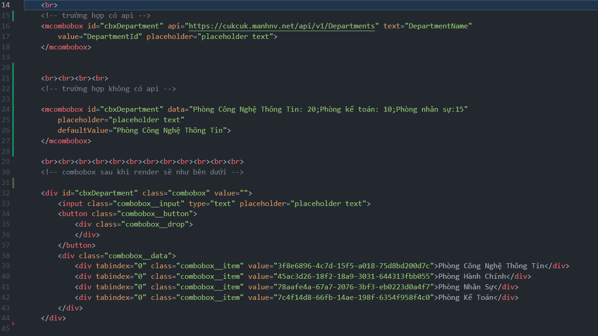

## Thư viện tạo combobox từ component đơn giản
Code sẽ được viết trong cặp thẻ mcombobox có dạng như sau
```html
có api
<mcombobox id="idName" api="https://something." text="content" value="content2" class="inputclass" data-title="title của input khi hover" validate="ValidateName"
placeholder="placeholder text" propName="something">
</mcombobox>
không có api
<mcombobox id="idName" data="Text1: value1;Text2: value2;Text3:valu3"  class="inputclass" data-title="title của input khi hover"
placeholder="placeholder text" defaultValue="Text1" unique="value1">
</mcombobox>
```
Trong đó :
- id: tên id của combobox muốn đặt
- api: địa chỉ api của trang web fetch data về
- text : giá trị của trường muốn lấy trong json trả về để gán vào textContent item
- value: giá trị của trường muốn lấy để gán vào value của item
- unique: giá trị mặc định được set bên phải value
( ví dụ ta có : 50 sản phẩm : 50 => value là 50 sản phẩm, unique là 50)
- placeholder: giá trị gợi ý khi chưa nhập vào input
- data: giá trị thay cho api, viết dạng Text1: value1;Text2: value2;Text3:valu3
- defaultValue: chỉ dùng khi có data, giá trị được chọn mặc định
- propName: tên riêng đặt cho combobox này\
Options :
- class: tên class của input muốn đặt
- data-title: dùng như tooltip, hover vào sẽ hiện lên
- validate: giá trị của trường validate, dùng để gọi các resource dựa vào tên validate này


````html
Thêm cặp thẻ sau vào đầu trang html để hiện được css mặc định của combobox
<link rel="stylesheet" href="css/combobox.css">

Thêm cặp thẻ sau vào cuối trang html để chạy được thư viện
<!-- script jquery -->
<script src="./js/jquery-3.6.1.min.js"></script>
<!-- script combobox -->
<script type="module" src="./js/combobox.js"></script>
````


Ngoài ra có thể sử dụng phím ESC để ẩn combobox
Phím Enter để nhập giá trị vào input và value vào combobox
Các phím lên xuống trái phải để điều hướng khi ấn tab index